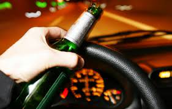

Blood Alcohol Concentration Slides
========================================================
author: Yap Koon Hoe
date: 24 Jan 2016

Drink and Driving
========================================================

It is an OFFENCE to drive while your BAC is reach certain limit.
Please checkout drunk driving law of the specific country at [Wikipedia](https://en.wikipedia.org/wiki/Drunk_driving_law_by_country)




What is Blood Alcohol Concentration ?
========================================================

- Blood alcohol concentration is the concentration of alcohol in one's bloodstream, expressed as percentage.
- Blood alcohol concentration(BAC) is used to determine whether a person is legally intoxicated, expecially under a driving while intoxicated law.

How is Blood Alcohol Concentration Measured ?
========================================================

- Blood alcohol concentration is measured by dividing grams of alcohol by 100 mililitres of blood
- This is then converted to a percentage, for example 0.02 grams of alcoho per 100 grams of invidual's blood,

```r
bac<-0.02/100*100
bac
```

```
[1] 0.02
```
The calculated BAC is 0.02%.
- Random breath testing(RBT) is carried by the Police to determined the BAC level.

What will Happen ?
========================================================

If your BAC is on or over the legal limit, you will be
- Charged 
- Photographed
- Required to appear in court

